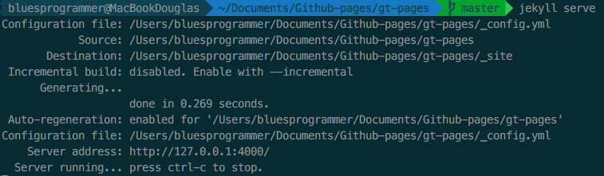

Pessoal, tomei a liberdade de dar o ponta pé inicial na ideia de escrever artigos. Como eu disse é muito simples usar o github pra gerar essas páginas.
Aqui está o modelo de como devemos seguir para automatizar o processo.
```
Obs.:
```
**Precisamos criar uma conta da GT (eu acho) ou Infoway (sei lá), para gerenciar o blog. Aqui na minha conta é só um exemplo de como pode funcionar.**


Escrevi também como o fluxo de publicação de Artigos deve funcionar, assim qualquer um que quiser escrever, basta seguir as **Guidelines** descritas. 
É muito tranquilo. Ahh, e detalhe, a galera do `Frontend` tome de conta. Eu criei tudo isso só pra dar um gás. haha ;P


#GT Artigos

Eis que numa mesa de bar, surge a ideia de criar artigos.

## Workflow de colaboração
Para colaborar com algum artigo, o autor deve seguir o seguinte fluxo:

1. Abrir uma [issue](https://github.com/douglasalexandre/douglasalexandre.github.io/issues) contendo:
	- Título do artigo
	- Descrição sucinta do artigo
	- Data de publicação
2. Escrever o artigo e fazer o Pull Request para esse repositório, no branch `master`
3. Certificar-se de que o artigo se encontra sob a licença [Creative Commons](https://br.creativecommons.org/)

## Como fazer Pull Request do artigo
- Faça um fork, baixe ou clone o repositório `https://github.com/douglasalexandre/douglasalexandre.github.io.git`
- Escreva seu artigo dentro do diretório [`_posts`](https://github.com/douglasalexandre/douglasalexandre.github.io/tree/master/_posts) (que contém todos os posts do blog e que por sua vez são escritos na linguagem de marcação markdown).
- Faça o Pull Request

## Estrutura do post
**Todos os posts** devem ter o seguinte nome: `2016-02-15-welcome-to-jekyll.markdown`, onde `YYYY-MM-DD-nome-do-artigo.markdown`.

**Todos os posts** devem conter o seguinte cabeçalho:

	---
	layout:     post
	title:      "Titulo do Artigo"
	subtitle:   "Subtitulo do Artigo"
	date:       YYYY-MM-DD 12:00:00
	author:     "Nome do Autor"
	header-img: "img/nomeDoUsuario/imagem.jpg" (imagem de cabeçalho)
	category:   Categoria
	---

### Como salvar imagens
Caso seu post tenha imagens, você deve adiciona-las no diretório [`img`](https://github.com/douglasalexandre/douglasalexandre.github.io/tree/master/img). **Porém não insira a imagem na raíz do diretório!** Crie um novo diretório com o nome do seu usuário e salve suas imagens nele. ;)

Sempre que você for utilizar a imagem, insira o caminho dela: `img/nomeDoUsuario/imagem.jpg`

### Como utilizar as imagens nos posts
Utilize `{{ site.baseurl }}` para concatenar com o diretório de imagem, como no exemplo abaixo: 

``

### Como editar markdown
Para escrever seu artigo, você pode utilizar editores markdown como o [MacDown](http://macdown.uranusjr.com/) ou [Atom](https://atom.io/packages/markdown-writer)!

## Revisão dos artigos
É importante os colaboradores revisarem os artigos para não serem publicados com erros ortográficos ou erros técnicos!

Você já pode ir fazendo Pull Request do seu artigo dentro do diretório [`_posts`](https://github.com/douglasalexandre/douglasalexandre.github.io/tree/master/_posts), pois ele só será exibido quando a data que foi especificada no cabeçalho chegar!

**É muito importante seu artigo estar pronto alguns dias antes da data de publicação, caso contrário medidas serão tomadas para manter as publicações diárias.**

## Como rodar localmente
1. Pelo terminal, vá ao diretório raíz onde o projeto está localizado
2. Caso não possua o Bundler instalado, execute `sudo gem install bundler`
2. Se for a primeira vez que você irá rodar esse projeto, execute `bundle install` para garantir que todas as dependências que o projeto utiliza existem. Caso negativo, o download será efetuado
2. Execute `jekyll serve` ou simplesmente `jekyll s`
3. Confira qual foi o *Server Address* gerado pelo jekyll 
4. Abra o navegador e entre no endereço

## Data de Publicação

